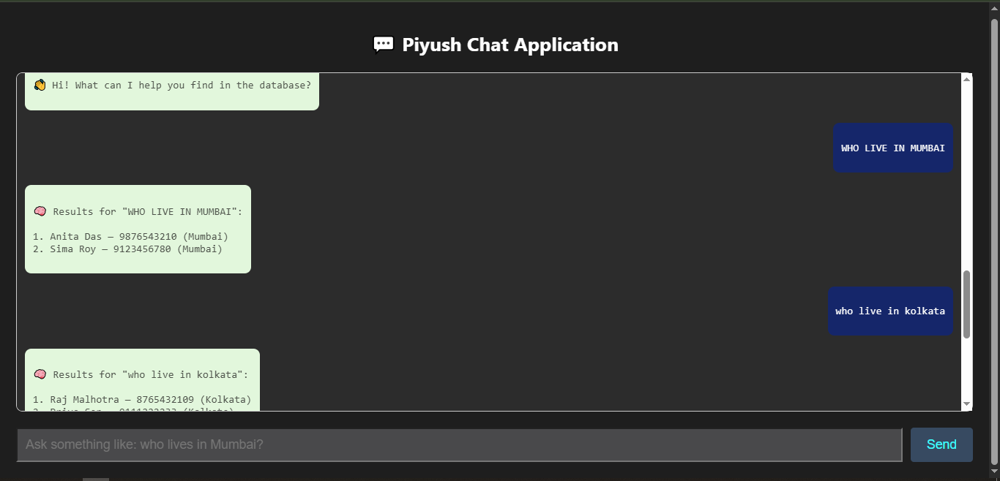
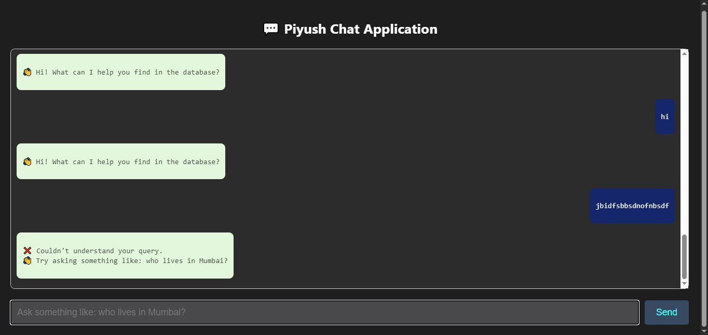

  <h1 style="font-size: 2.5rem; margin-bottom: 10px;">🤖 LLM-Powered Chatbot</h1>
  <h3 style="font-weight: normal;">FastAPI + React + MySQL + Groq LLMs</h3>

  <h2 style="color:#ff6f61;">🎥 Live Demo</h2>
  <video width="80%" controls>
    <source src="assets/video1.mp4" type="video/mp4">
    Your browser does not support the video tag.
  </video>
  
Watch the chatbot convert your natural language queries to real-time SQL
    and display database results instantly.

<h2 style="color:#764ba2;">🛠️ How This Project Was Built</h2>

<ul>
  <li><strong>Frontend:</strong> React (HTML + CSS + Axios)</li>
  <li><strong>Backend:</strong> FastAPI with REST endpoints</li>
  <li><strong>LLM:</strong> Groq-hosted LLaMA or Mistral for converting natural language to
      SQL</li>
  <li><strong>Database:</strong> MySQL with a <code>customer</code> table</li>
  <li><strong>Security:</strong> API Key stored securely in <code>.env</code> file</li>
</ul>

<h2 style="color:#764ba2;">🚀 Getting Started</h2>

<ol>
  <li><b>Install React dependencies:</b> <code>cd frontpart</code> <code>npm install</code></li>
  <li><b>Build the React frontend:</b> <code>npm run build</code></li>
  <li><b>Return to backend:</b> <code>cd ..</code></li>
  <li><b>Create .env file:</b> <code>echo "GROQ_API_KEY=your_key_here" > .env</code></li>
  <li><b>Install Python backend
      packages:</b> <code>pip install fastapi uvicorn python-dotenv requests mysql-connector-python</code></li>
  <li><b>Run the FastAPI server:</b> <code>.\venv\Scripts\activate</code> <code>uvicorn main:app --reload</code>
  </li>
</ol>

<h2 style="color:#764ba2;">🌐 Access the App</h2>

<ul>
  <li><b>Frontend:</b> <a href="http://localhost:3000" target="_blank">http://localhost:3000</a></li>
  <li><b>API Endpoint:</b> <code>POST /query</code></li>
</ul>

<h2 style="color:#764ba2;">🧪 Try These Sample Questions</h2>

<ul>
  <li>Who lives in Mumbai?</li>
  <li>Show all customers</li>
  <li>Get names and phone numbers from Delhi</li>
  <li>List all female customers</li>
</ul>

<h2 style="color:#764ba2;">📦 Tech Stack Used</h2>

<table style="width:100%; border:1px solid #ddd;">
  <tr style="background:#f6f6f6;">
    <th align="left">Layer</th>
    <th align="left">Technology</th>
  </tr>
  <tr>
    <td>💡 LLM</td>
    <td>Groq-hosted LLaMA or Mistral</td>
  </tr>
  <tr>
    <td>🎨 Frontend</td>
    <td>HTML, CSS, ReactJS</td>
  </tr>
  <tr>
    <td>🧠 Backend</td>
    <td>Python, FastAPI</td>
  </tr>
  <tr>
    <td>🗄️ Database</td>
    <td>MySQL</td>
  </tr>
  <tr>
    <td>🔐 Secrets</td>
    <td>.env</td>
  </tr>
</table>

<h2 style="color:#764ba2;">🔐 Security Notes</h2>

<ul>
  <li>✅ API key is hidden using <code>.env</code></li>
  <li>✅ <code>.env</code> is ignored in git with <code>.gitignore</code></li>
  <li>✅ Only SELECT queries allowed from LLM</li>
</ul>

<h2 style="color:#764ba2; text-align:center;">📸 Screenshots</h2>

  <h3 style="color:#4caf50;">✅ Successfully Executed Query</h3>
  
  
The chatbot successfully converted a natural language query into SQL and
    displayed the result from the database.

 

  <h3 style="color:#f44336;">❌ Unrecognized Query</h3>
  
  
When the chatbot cannot interpret the natural language input, it responds with
    a fallback message prompting for a clearer query.

<h2 style="color:#764ba2;">📌 Future Enhancements</h2>

<ul>
  <li>🔐 Add authentication system</li>
  <li>📡 Deploy backend to cloud (Render/Railway)</li>
  <li>🗃️ Add support for more tables and databases</li>
  <li>📤 Add file upload to import customer data</li>
</ul>

<h2 style="color:#764ba2;">🤝 Contributing</h2>

If you like this project, feel free to fork it and raise PRs for suggestions!
